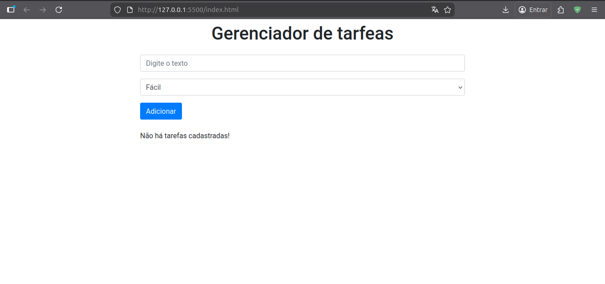
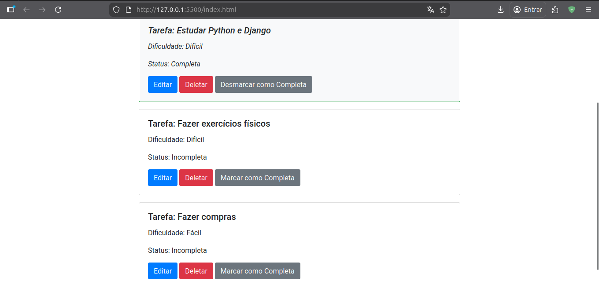

# HTMX Todo List Project

A simple and efficient Todo List manager built with **HTMX** for dynamic frontend interactions and a **Node.js/Express** backend with **Sequelize** and **SQLite**.

## 🚀 Technologies Used

- **HTMX**: For making AJAX requests directly from HTML attributes, providing an SPA-like experience without complex JavaScript.
- **Bootstrap 4**: For quick and responsive styling.
- **Node.js**: Backend runtime environment.
- **Express**: Fast, unopinionated, minimalist web framework for Node.js.
- **Sequelize**: Promise-based Node.js ORM for SQLite.
- **SQLite**: Lightweight disk-based database.

## 📁 Project Structure

```text
.
├── api
│   ├── db
│   │   └── database.sqlite (not versioned)
│   ├── index.js
│   ├── package.json
│   └── package-lock.json
├── assets
│   └── js
│       └── scripts.js
├── index.html
└── README.md
```

> [!NOTE]
> The `.github` folder is omitted from this structure overview.

## 🛠️ How to Execute

### 1. Prerequisites

- [Node.js](https://nodejs.org/) installed on your machine.
- A web server (like **Live Server** extension in VS Code) or simply open the HTML file if you are not using a server (though HTMX requests might need a server context to avoid CORS issues).

### 2. Backend Setup

1. Open your terminal and navigate to the `api` folder:

   ```bash
   cd api
   ```

2. Install dependencies:

   ```bash
   npm install
   ```

3. Start the server:

   ```bash
   node index.js
   ```

   The backend will be running at `http://localhost:3000`.

> [!NOTE]
> The `database.sqlite` file is not versioned (ignored by Git) and will be automatically created in the `api/db` directory when you start the server for the first time.

### 3. Frontend Setup

- **Option A (Live Server):** If you have the VS Code Live Server extension, right-click on `index.html` and select **"Open with Live Server"**.
- **Option B (Direct):** Open `index.html` directly in your browser. (Note: HTMX might require a local server to function correctly due to security restrictions).

---

## 📸 Previews





---

Developed for educational purposes.
